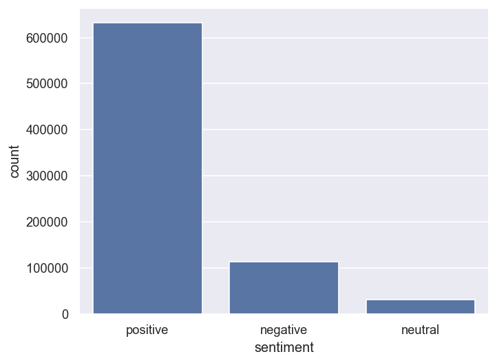
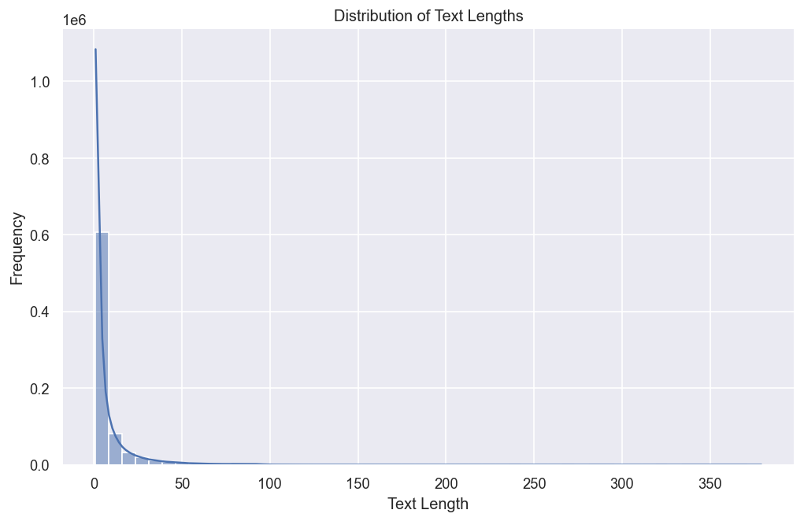
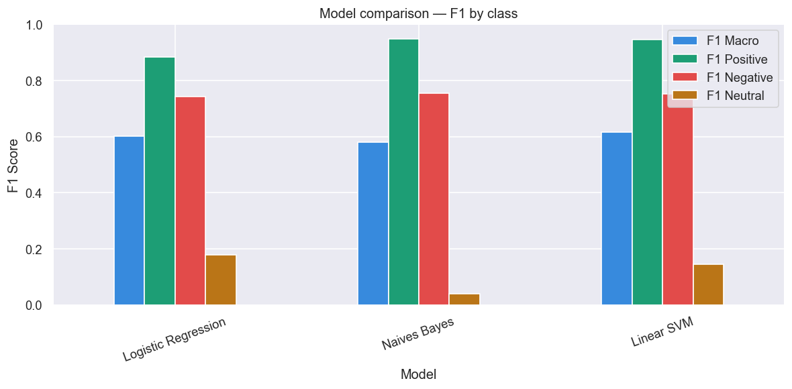
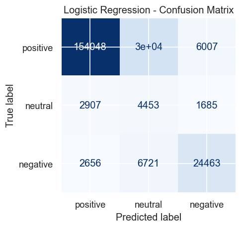
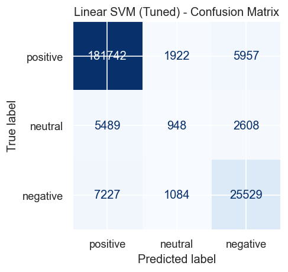
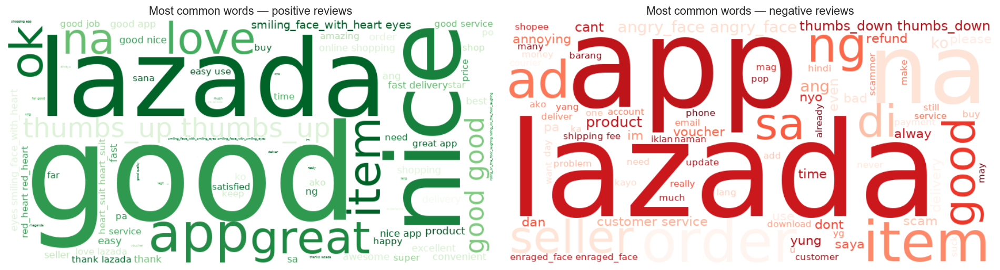
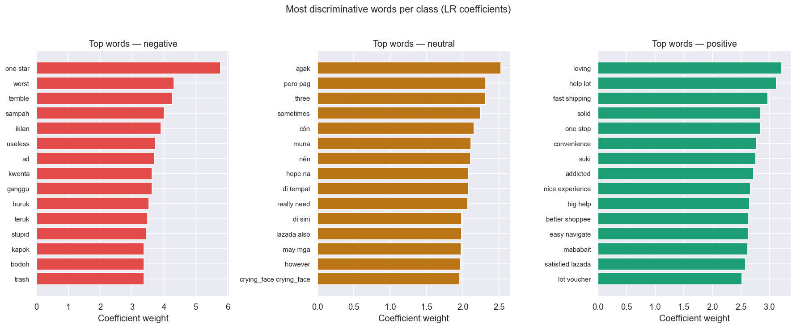

# Lazada App Reviews — Sentiment Analysis

A multiclass NLP sentiment classifier trained on **775,000+ real customer reviews** from Lazada's Google Play Store listing. The project covers the full ML pipeline: raw text ingestion → EDA → preprocessing → feature engineering → model comparison → final model selection → business recommendations.

---

## Table of Contents
- [Overview](#overview)
- [Dataset](#dataset)
- [Tech Stack](#tech-stack)
- [Project Pipeline](#project-pipeline)
- [Models & Results](#models--results)
- [Analysis of Results](#analysis-of-results)
- [Business Findings & Recommendations](#business-findings--recommendations)
- [Key Challenges & Solutions](#key-challenges--solutions)
- [Project Structure](#project-structure)
- [Getting Started](#getting-started)

---

## Overview

The goal is to classify customer sentiment (positive / neutral / negative) from free-form text reviews of the Lazada mobile app. Rather than relying on star ratings alone, the model learns linguistic patterns from cleaned, tokenized review text, making it applicable to unrated text data in the future.

**Target variable:** `sentiment` (derived from `review_rating`)
- ⭐⭐⭐⭐–⭐⭐⭐⭐⭐ → Positive
- ⭐⭐⭐ → Neutral
- ⭐–⭐⭐ → Negative

---

## Dataset

| Property | Value |
|---|---|
| Source | [Kaggle — Lazada App Reviews (Google Store)](https://www.kaggle.com/datasets/bwandowando/lazada-app-reviews-from-google-store/data) |
| Rows | 775,323 |
| Features used | `review_text`, `review_rating` |
| Date range | 2013 – 2023 |
| Class distribution | Severely imbalanced (positive-heavy: ~81.6% positive, ~14.6% negative, ~3.9% neutral) |

---

## Tech Stack

| Category | Libraries |
|---|---|
| Data manipulation | `pandas`, `numpy` |
| Visualisation | `matplotlib`, `seaborn`, `wordcloud` |
| NLP & text | `nltk`, `emoji`, `re` |
| Feature engineering | `TF-IDF` (scikit-learn) |
| ML models | `scikit-learn`, `imbalanced-learn` |
| Model persistence | `joblib` |

---

## Project Pipeline

### 1. Exploratory Data Analysis (EDA)

- Inspected class distribution — found a **severe class imbalance**: positive reviews (~81.6%) overwhelmingly dominated the dataset, with neutral reviews being extremely scarce (~3.9%).



- Analysed review text length distribution (mean: 7 words, max: 379 words); identified that long multi-sentiment reviews could confuse classifiers.



- Verified reviewer bias: confirmed no single author posted more than 2 reviews, ruling out individual-level data skew.
- Handled missing values in `review_text` (305 null rows dropped).

### 2. Text Preprocessing

A reusable `clean_text()` function applies the following steps in order:

| Step | Technique | Rationale |
|---|---|---|
| Lowercasing | `str.lower()` | Normalise vocabulary |
| URL / HTML / mention removal | `re.sub()` | Strip non-semantic noise |
| Number removal | `re.sub(r'\d+', '', ...)` | Remove order IDs, dates |
| Punctuation removal | `str.translate()` | Reduce noise |
| Emoji conversion | `emoji.demojize()` | Preserve emoji sentiment as text |
| Repeated character normalisation | regex `(.)\1{2,}` | "goooood" → "good" |
| Tokenisation | `nltk.word_tokenize()` | Split text into tokens |
| Stopword removal | `nltk.corpus.stopwords` | Remove low-signal function words |
| Lemmatisation | `WordNetLemmatizer` | Reduce inflected forms to root ("running" → "run") |

> **Lemmatisation vs Stemming:** Lemmatisation was chosen over stemming for more linguistically accurate root forms, which improves TF-IDF feature quality at the cost of slightly higher computation.

### 3. Feature Engineering — TF-IDF Vectorisation

- **TF-IDF** (Term Frequency–Inverse Document Frequency) used to convert cleaned text into numerical feature vectors.
- `max_features=5000` to cap vocabulary size and prevent overfitting on rare terms.
- `ngram_range=(1, 2)` to capture both unigrams and bigrams (e.g., "not good" treated as a single feature).

### 4. Class Imbalance Handling

- Used `class_weight='balanced'` in Logistic Regression and Linear SVM to penalise misclassification of minority classes proportionally.
- Evaluated macro-averaged F1 score (treats all classes equally) alongside accuracy to avoid misleading results from class imbalance.

### 5. Model Training & Hyperparameter Tuning

- Stratified 70/30 train-test split with `stratify=y` to preserve class proportions.
- Scikit-learn `Pipeline` used throughout to prevent data leakage (vectoriser fitted only on training data).
- **Stratified K-Fold Cross-Validation** (5 folds) for robust, unbiased performance estimates.
- **GridSearchCV** used for Naive Bayes and SVM hyperparameter tuning.

---

## Models & Results

Three classifiers were benchmarked against the same preprocessed dataset:

| Model | Accuracy | F1 Macro | F1 Weighted | Notes |
|---|---|---|---|---|
| Logistic Regression | 0.7754 | 0.5898 | 0.8263 | Baseline; `class_weight='balanced'` |
| Multinomial Naive Bayes | 0.8996 | 0.5800 | 0.8840 | Tuned with GridSearchCV (alpha, fit_prior) |
| **Linear SVM (SGD) ✅** | **0.8943** | **0.6127** | **0.8864** | Best F1 Macro; scalable SVM via `SGDClassifier` |

**Winner: Linear SVM with TF-IDF (best F1 Macro: 0.6127)**

Linear SVM outperformed both alternatives on macro F1 — the most meaningful metric under class imbalance since it treats all three classes equally. While Naive Bayes achieved the highest raw accuracy (0.8996), its F1 Macro was lower (0.5800) due to poor neutral class recall. Linear SVM achieved the best balance across all three classes.



> **Note on neutral class:** F1 Neutral is consistently the lowest across all models. A 3-star rating does not reliably map to neutral language — users write both positive and negative text for 3-star reviews. For a production system, collapsing to binary (positive vs. negative) would yield more reliable results.

The best pipeline is serialised to `best_pipeline.pkl` and all models to `all_models.pkl` for downstream inference without retraining.

### Confusion Matrices






---

## Analysis of Results

### Word Clouds — What are customers saying?

The word clouds below visualise the most frequent terms in positive and negative reviews after text preprocessing.



### Top Discriminative Words (Logistic Regression Coefficients)

LR coefficients reveal which words most strongly push the model toward each sentiment class. Unlike raw word frequency, this shows *relative* predictive importance.



---

## Business Findings & Recommendations

### Overall Sentiment Breakdown
| Sentiment | Share |
|---|---|
| Positive | 81.6% |
| Negative | 14.6% |
| Neutral | 3.9% |

### Key Findings

1. **Overall satisfaction is high (~81.6% positive):** the majority of Lazada users rate the app favourably, indicating a strong baseline brand perception.

2. **Negative reviews concentrate on app performance:** the top discriminative words for negative sentiment consistently include terms related to crashes, slowness, errors, and update failures. App stability is the primary pain point.

3. **Neutral is the hardest class to model (F1 ~0.14–0.16):** a 3-star rating does not reliably map to neutral language. For a production deployment, binary classification (positive vs. negative) would give more reliable and actionable results.

4. **Sentiment trends can serve as product signals:** spikes in negative review volume correlate with app release windows. The product engineering team can use this as an early-warning system to catch regressions post-release.

5. **Linear SVM is the strongest lightweight model** on F1 Macro. The trained pipeline can score any new review in milliseconds with `pipeline.predict([review_text])`.

### Recommendations for Lazada

| Priority | Action | Evidence |
|---|---|---|
| High | Investigate crash/performance issues in app updates | Top negative discriminative words |
| High | Monitor negative % weekly after each app release | Sentiment distribution |
| Medium | Deploy this pipeline for real-time review tagging | Saved `best_pipeline.pkl` |
| Medium | Run topic modelling on negative reviews (BERTopic/LDA) | Identify specific feature complaints |
| Low | Experiment with binary classification (positive vs. negative) | Neutral class unreliable (F1 ~0.14) |

---

## Key Challenges & Solutions

| Challenge | Solution |
|---|---|
| **Severe class imbalance** (positive >> neutral) | `class_weight='balanced'` in LR and SVM + macro F1 as primary evaluation metric |
| **Data leakage risk** from TF-IDF | Wrapped vectoriser + classifier inside a `sklearn.Pipeline` |
| **Large dataset** (775K rows) — SVC too slow | Replaced `SVC` with `SGDClassifier(loss='hinge')` — equivalent to linear SVM, scales linearly |
| **Multi-sentiment long reviews** | Lemmatisation + TF-IDF bigrams to capture phrase-level context |
| **Noisy informal text** (emojis, slang) | `emoji.demojize()` to preserve emoji sentiment; regex-based normalisation for repeated characters |

---

## Project Structure

```
├── Sentimental Analysis (Lazada).ipynb   # Main notebook
├── LAZADA_REVIEWS.csv                    # Raw dataset (from Kaggle)
├── all_models.pkl                        # All trained model pipelines (joblib)
├── best_pipeline.pkl                     # Best model pipeline — Linear SVM (joblib)
└── README.md
```

---

## Getting Started

```bash
# Install dependencies
pip install pandas numpy matplotlib seaborn scikit-learn nltk emoji wordcloud langdetect
pip install transformers torch
pip install sentencepiece
pip install imbalanced-learn

# Download NLTK assets (first run)
python -c "import nltk; nltk.download('stopwords'); nltk.download('punkt'); nltk.download('wordnet')"
```

Then open `Sentimental Analysis (Lazada).ipynb` in Jupyter and run all cells.

To load and use the best saved model directly:

```python
import joblib

# Best model pipeline (Linear SVM + TF-IDF)
pipeline = joblib.load("best_pipeline.pkl")

pipeline.predict(["This app keeps crashing, very frustrating"])  # ['negative']
pipeline.predict(["Great deals and fast shipping!"])             # ['positive']
```

To load all models:

```python
import joblib

models = joblib.load("all_models.pkl")

lr_pipeline  = models["logistic"]
nb_pipeline  = models["naives_baye"]
svm_pipeline = models["LinearSVC"]
```

---

## Acknowledgements

Dataset sourced from [Kaggle — Lazada App Reviews (Google Store)](https://www.kaggle.com/datasets/bwandowando/lazada-app-reviews-from-google-store/data) by bwandowando.

## Where I would take this next

- **Hand-label a validation set to separate label noise from model error.** `sentiment` is derived from `review_rating`, so the model is learning to predict stars. Since 3-star text is genuinely bimodal, a few hundred hand-labelled reviews would quantify how much of the neutral-class gap is reachable at all. That measurement is worth having before further tuning, because the neutral class is where the macro F1 headroom sits.
- **Add a transformer baseline.** TF-IDF discards word order, so negation is invisible to the model: "not good" and "good" share the same features. A fine-tuned encoder would capture it, and the comparison against this Linear SVM would be the most interesting result in the project. I built that model afterwards in [sg-sentiment-roberta](https://github.com/ChewYiSiang/sg-sentiment-roberta), so the head-to-head is a short step from here.
- **Compare the 3-class framing against binary.** Collapsing to positive versus negative would test directly whether a coarser target yields more actionable output for a business reader, rather than assuming it.
- **Serve the pipeline behind an endpoint.** It currently scores in-process. A small FastAPI service would make the result verifiable by someone else, and reusable on new review streams.
